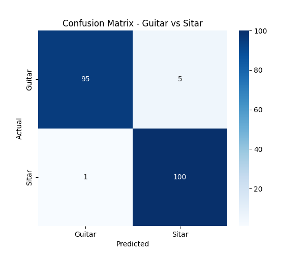

# Image Classification Assignment Report

## Part 1: CIFAR-10 Sub-Dataset (5 Classes)

### Dataset Preparation
We downloaded the official CIFAR-10 dataset and filtered it to keep only 5 classes: **airplane, automobile, bird, cat, and deer**.
The resulting dataset was then split using a stratified 70% Train, 15% Validation, and 15% Test configuration.

| Class | Train | Val | Test | Total |
|---|---|---|---|---|
| airplane | 4,250 | 750 | 1,000 | 6,000 |
| automobile | 4,250 | 750 | 1,000 | 6,000 |
| bird | 4,250 | 750 | 1,000 | 6,000 |
| cat | 4,250 | 750 | 1,000 | 6,000 |
| deer | 4,250 | 750 | 1,000 | 6,000 |
| **Total** | **21,250** | **3,750** | **5,000** | **30,000** |

### Training Results (MobileNetV2)
The pretrained MobileNetV2 model was fine-tuned for 15 epochs. 
- **Phase 1 (Warm-up)**: Epochs 1-5 with the backbone frozen.
- **Phase 2 (Fine-tuning)**: Epochs 6-15 with the entire network unfrozen.

**Final Evaluation on Test Set (5,000 images):**
- **Accuracy:** 80.50%
- **Precision:** 80.95%
- **Recall:** 80.50%

---

## Part 2: Guitar vs Sitar Classification

### Dataset Preparation
The custom dataset was processed and split into Train, Validation, and Test sets based on the provided class folders.

| Class | Train | Val | Test |
|---|---|---|---|
| Guitar | 765 | 135 | 100 |
| Sitar | 765 | 135 | 101 |

### Training Results (MobileNetV2)
The model was fine-tuned for 10 epochs.

**Final Evaluation on Test Set (201 images):**
- **Accuracy:** 97.01%
- **Precision:** 97.10%
- **Recall:** 97.00%

### Inference (OpenCV Overlay)
We ran the single-image inference script on a sample from the test set. The script correctly predicted **Guitar** with **99.94%** confidence and successfully drew the label onto the image using OpenCV.

