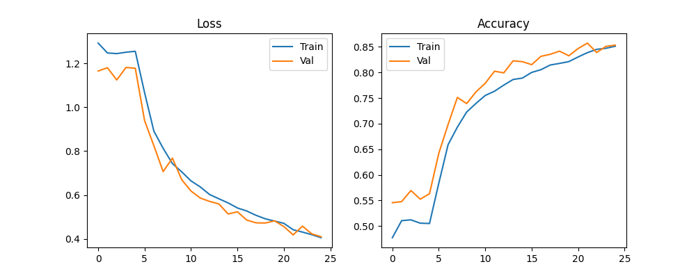
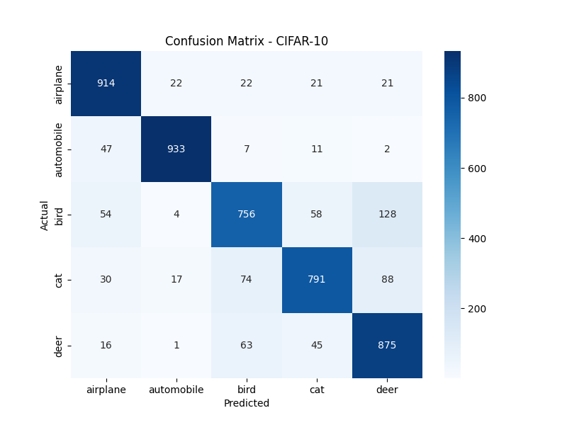
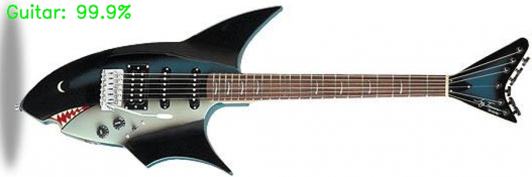

# Image Classification — Assignment Submission

**Submitted by:** Anshul  
**GitHub Repository:** [anshul-art/ML-Image-Classification](https://github.com/anshul-art/ML-Image-Classification)

---

## Table of Contents

1. [Environment Setup](#environment-setup)
2. [Part 1: CIFAR-10 Classification (5 Classes)](#part-1-cifar-10-classification-5-classes)
   - [Dataset Preparation](#11-dataset-preparation)
   - [Model Architecture](#12-model-architecture)
   - [Data Augmentation](#13-data-augmentation)
   - [Training Strategy](#14-training-strategy)
   - [TensorBoard Logging](#15-tensorboard-logging)
   - [Training Results](#16-training-results)
   - [Evaluation on Test Set](#17-evaluation-on-test-set)
   - [Inference](#18-inference)
3. [Part 2: Guitar vs Sitar Classification](#part-2-guitar-vs-sitar-classification)
   - [Dataset Preparation](#21-dataset-preparation)
   - [Model Architecture & Training](#22-model-architecture--training)
   - [Evaluation on Test Set](#23-evaluation-on-test-set)
   - [Inference with OpenCV Overlay](#24-inference-with-opencv-overlay)
4. [Observations & Learnings](#observations--learnings)
5. [How to Run](#how-to-run)

---

## Environment Setup

| Component | Details |
|---|---|
| **OS** | Windows 10 Pro |
| **Python** | 3.9.13 |
| **PyTorch** | 2.4.1 |
| **GPU** | AMD Radeon RX 6700 XT (12 GB VRAM) |
| **GPU Backend** | DirectML (since AMD GPUs do not support CUDA) |
| **Key Libraries** | torchvision, scikit-learn, TensorBoard, OpenCV, matplotlib, seaborn |

> **Note on GPU:** Standard PyTorch CUDA does not work with AMD GPUs. I used Microsoft's `torch-directml` package as an alternative, which provides hardware-accelerated training on AMD GPUs via DirectX. The device selection code automatically falls back from CUDA → DirectML → CPU.

---

## Part 1: CIFAR-10 Classification (5 Classes)

### 1.1 Dataset Preparation

**Script:** `part1_cifar10/dataset_prep.py`

**Steps performed:**
1. Downloaded the official CIFAR-10 dataset using `torchvision.datasets.CIFAR10`
2. Filtered from 10 classes to 5: **airplane, automobile, bird, cat, deer**
3. Removed 5 classes: dog, frog, horse, ship, truck
4. Kept the official CIFAR-10 test set untouched as our test set
5. Split the official training set into **train (85%)** and **validation (15%)** using stratified sampling (`sklearn.model_selection.train_test_split` with `stratify=targets`)
6. Saved the processed dataset as a `.pt` file for efficient loading

**Final Dataset Statistics:**

| Class | Train | Validation | Test | Total |
|---|:---:|:---:|:---:|:---:|
| airplane | 4,250 | 750 | 1,000 | 6,000 |
| automobile | 4,250 | 750 | 1,000 | 6,000 |
| bird | 4,250 | 750 | 1,000 | 6,000 |
| cat | 4,250 | 750 | 1,000 | 6,000 |
| deer | 4,250 | 750 | 1,000 | 6,000 |
| **Total** | **21,250** | **3,750** | **5,000** | **30,000** |

> The dataset is perfectly balanced across all classes with equal representation in each split, thanks to stratified sampling.

---

### 1.2 Model Architecture

**Model:** MobileNetV2 (pre-trained on ImageNet)

- Loaded using `torchvision.models.mobilenet_v2(weights=MobileNet_V2_Weights.DEFAULT)`
- The pre-trained model outputs 1,000 ImageNet classes
- Replaced the final classifier layer: `Linear(1280 → 1000)` → `Linear(1280 → 5)` to match our 5-class task
- Total parameters: ~3.4 million (lightweight architecture designed for efficiency)

---

### 1.3 Data Augmentation

**Training Transforms:**

| Transform | Purpose |
|---|---|
| `RandomCrop(32, padding=4)` | Pads image to 40×40 then randomly crops to 32×32 — simulates position shifts |
| `RandomHorizontalFlip()` | 50% chance of horizontal flip — effectively doubles data variety |
| `ToTensor()` | Converts PIL image to tensor, scales pixel values from [0,255] to [0.0,1.0] |
| `Normalize(mean, std)` | Normalizes using CIFAR-10 dataset statistics: mean=(0.4914, 0.4822, 0.4465), std=(0.2023, 0.1994, 0.2010) |

**Validation/Test Transforms:** `ToTensor()` + `Normalize()` only (no augmentation — deterministic evaluation).

---

### 1.4 Training Strategy

**Script:** `part1_cifar10/train.py`

Used a **two-phase transfer learning** approach:

| Phase | Epochs | What's Trainable | Learning Rate | Optimizer |
|---|:---:|---|:---:|---|
| **Phase 1 — Warm-up** | 1 – 5 | Classifier head only (backbone frozen) | 1e-3 | Adam |
| **Phase 2 — Fine-tuning** | 6 – 25 | Entire network (backbone unfrozen) | 1e-4 | Adam |

**Rationale:**
- **Phase 1:** The new classifier head has random weights. Training only the head first prevents large random gradients from corrupting the pre-trained backbone features.
- **Phase 2:** Once the classifier is stabilized, we unfreeze the entire model and fine-tune with a lower learning rate. This gently adapts the backbone features to our specific task without "forgetting" ImageNet knowledge.

**Additional details:**
- **Batch size:** 32
- **Loss function:** CrossEntropyLoss
- **Model checkpointing:** Saved model weights only when validation accuracy improved (best model selection)

---

### 1.5 TensorBoard Logging

Training metrics were logged using PyTorch's `SummaryWriter`:

| Metric Logged | Granularity |
|---|---|
| Training Loss | Per batch and per epoch |
| Validation Loss | Per epoch |
| Training Accuracy | Per epoch |
| Validation Accuracy | Per epoch |

To view: `tensorboard --logdir=part1_cifar10/logs/`

---

### 1.6 Training Results

**Training curves (25 epochs — 5 warm-up + 20 fine-tune):**



**Observations from the plots:**
- **Epochs 1-5 (warm-up):** Loss decreases slowly, accuracy stays around 50-55% — only the classifier head is learning.
- **Epoch 6 (backbone unfreezes):** Visible jump — both loss drops and accuracy increases as the entire network starts adapting.
- **Epochs 6-25 (fine-tuning):** Steady improvement. Train and validation curves track closely, indicating no severe overfitting.
- **Final training accuracy:** ~85% | **Final validation accuracy:** ~85%
- **Best validation accuracy:** 85.73% (at epoch 22)
- **Loss curves converge** by epoch 25, indicating the model has nearly reached its capacity at 32×32 resolution.

---

### 1.7 Evaluation on Test Set

**Script:** `part1_cifar10/evaluate.py`

**Overall Metrics (macro-averaged):**

| Metric | Score |
|---|:---:|
| **Accuracy** | **85.38%** |
| **Precision** | **85.52%** |
| **Recall** | **85.38%** |

> Precision and recall use **macro-averaging** — computed independently for each class and then averaged with equal weight. This treats all classes equally regardless of sample count. With a balanced dataset (1,000 test samples per class), macro and weighted averages produce nearly identical results.

**Per-Class Breakdown:**

| Class | Precision | Recall | Observation |
|---|:---:|:---:|---|
| airplane | 86.15% | 91.40% | High recall — distinctive shape/sky background |
| automobile | 95.50% | 93.30% | Highest overall — very distinctive appearance |
| bird | 82.00% | 75.60% | Lowest recall — small features at 32×32 |
| cat | 85.42% | 79.10% | Improved significantly — still confused with animals |
| deer | 78.55% | 87.50% | Good recall — distinctive body shape |

**Confusion Matrix:**



**Key observations from the confusion matrix:**
- **Automobile** has the strongest diagonal (933/1000 correct) — easiest to classify
- **Airplane** is close behind (914/1000 correct) with high recall (91.40%)
- **Deer** improved significantly (875/1000 correct) compared to the 15-epoch model
- **Bird ↔ Deer** confusion (128 birds misclassified as deer) — animal shape similarity at 32×32
- **Cat ↔ Deer** confusion (88 cats misclassified as deer) — four-legged mammal similarity
- **Bird** still has the lowest recall (75.60%) — the hardest class at 32×32 resolution, but improved from 65.70%

---

### 1.8 Inference

**Script:** `part1_cifar10/inference.py`

**Usage:** `python inference.py <image_path>`

The script loads a single image, runs it through the trained model, and outputs the **probability for every class**:

```
Prediction: airplane (92.34%)
  airplane: 92.34%
  automobile: 3.12%
  bird: 2.56%
  cat: 0.98%
  deer: 1.00%
```

---

## Part 2: Guitar vs Sitar Classification

### 2.1 Dataset Preparation

**Script:** `part2_guitar_sitar/dataset_prep.py`

**Steps performed:**
1. Extracted the provided `gvs_dataset.zip`
2. Reorganized images from the original folder structure (`Train_Imgs/`, `Test_Imgs/`) into the standard `train/val/test` structure expected by `torchvision.datasets.ImageFolder`
3. Split training images into **train (85%)** and **validation (15%)**
4. Cleaned up temporary extraction folder

**Final Dataset Statistics:**

| Class | Train | Validation | Test |
|---|:---:|:---:|:---:|
| Guitar | 765 | 135 | 100 |
| Sitar | 765 | 135 | 101 |
| **Total** | **1,530** | **270** | **201** |

---

### 2.2 Model Architecture & Training

**Script:** `part2_guitar_sitar/train.py`

Same MobileNetV2 transfer learning approach as Part 1, with key adaptations:

| Parameter | Part 1 (CIFAR-10) | Part 2 (Guitar/Sitar) | Reason for difference |
|---|---|---|---|
| **Input size** | 32×32 | 224×224 | Guitar/Sitar are high-res photos; 224×224 is MobileNetV2's design size |
| **Normalization** | CIFAR-10 stats | ImageNet stats | Natural photos are closer to ImageNet's distribution |
| **Classifier output** | 5 classes | 2 classes | Binary classification task |
| **Augmentation** | RandomCrop, HFlip | HFlip, RandomRotation(10°) | Instruments can appear at slight angles |
| **Warm-up epochs** | 5 | 3 | Smaller dataset — fewer warm-up epochs needed |
| **Fine-tune epochs** | 20 | 7 | Smaller dataset — more epochs would risk overfitting |
| **Batch size** | 32 | 16 | 224×224 images consume more GPU memory |
| **Dataset loader** | Custom Dataset class | `ImageFolder` | ImageFolder automatically loads from folder structure |

---

### 2.3 Evaluation on Test Set

**Script:** `part2_guitar_sitar/evaluate.py`

**Overall Metrics (macro-averaged):**

| Metric | Score |
|---|:---:|
| **Accuracy** | **97.01%** |
| **Precision** | **97.10%** |
| **Recall** | **97.00%** |

**Per-Class Breakdown:**

| Class | Precision | Recall |
|---|:---:|:---:|
| Guitar | 98.96% | 95.00% |
| Sitar | 95.24% | 99.01% |

> **Why is Part 2 accuracy (97%) so much higher than Part 1 (85%)?**
> 1. **Fewer classes:** 2 vs 5 — binary classification is inherently easier
> 2. **Higher resolution:** 224×224 vs 32×32 — much more detail available for the model
> 3. **More distinctive features:** Guitar and sitar have very different shapes and structures

**Confusion Matrix:**


**Observations:**
- Only **6 total misclassifications** out of 201 test images
- 5 guitars were misclassified as sitar, 1 sitar was misclassified as guitar
- The model is slightly more conservative on guitar predictions (higher precision) and slightly more aggressive on sitar predictions (higher recall)

---

### 2.4 Inference with OpenCV Overlay

**Script:** `part2_guitar_sitar/inference.py`

**Usage:** `python inference.py <image_path>`

The script runs inference on a single image and produces an output with **OpenCV text overlay** showing the probability for **every class**:

```
Guitar: Yes (99.9%)
Sitar:  No  (0.1%)
```

- The predicted class is displayed in **green** with "Yes"
- Other classes are displayed in **red** with "No"
- The annotated image is saved as `pred_<original_filename>`

**Sample output:**



> The model correctly predicted **Guitar** with **99.94% confidence** on this sample test image.

---

## Observations & Learnings

### Transfer Learning Effectiveness
- Using a pre-trained MobileNetV2 backbone significantly reduced the training data and epochs needed
- The two-phase strategy (freeze → unfreeze) is critical — without it, the random classifier head gradients would destroy pre-trained features during early training

### Data Augmentation Impact
- RandomCrop and RandomHorizontalFlip are simple but effective augmentations for image classification
- Augmentation is especially important for smaller datasets (Part 2) to prevent overfitting

### Resolution Matters
- CIFAR-10's 32×32 resolution is a significant limitation — fine-grained features like cat vs bird whiskers are lost at this scale
- Part 2's 224×224 resolution allows the model to leverage the full capacity of MobileNetV2's architecture

### GPU Compatibility
- AMD GPUs require alternative acceleration (DirectML) since PyTorch's default CUDA only supports NVIDIA
- The `get_device()` function with CUDA → DirectML → CPU fallback ensures the code is portable across hardware

### Evaluation Methodology
- Macro-averaging treats all classes equally, making it suitable for balanced datasets
- Per-class metrics reveal which categories the model struggles with (e.g., cat and bird at 32×32)
- Confusion matrices provide the most detailed view of misclassification patterns

---

## How to Run

### Prerequisites
```bash
pip install -r requirements.txt
```

### Part 1: CIFAR-10
```bash
cd part1_cifar10
python dataset_prep.py      # Download and prepare dataset
python train.py              # Train model (25 epochs)
python evaluate.py           # Evaluate on test set
python inference.py <image>  # Run inference on a single image
tensorboard --logdir=logs/   # View training logs
```

### Part 2: Guitar vs Sitar
```bash
cd part2_guitar_sitar
python dataset_prep.py      # Extract and organize dataset
python train.py              # Train model (10 epochs)
python evaluate.py           # Evaluate on test set
python inference.py <image>  # Run inference with OpenCV overlay
```

---

## Project Structure
```
Image Classification/
├── part1_cifar10/
│   ├── dataset_prep.py          # Download, filter, split CIFAR-10
│   ├── train.py                 # Two-phase MobileNetV2 training
│   ├── evaluate.py              # Test set metrics + confusion matrix
│   ├── inference.py             # Single image inference
│   ├── training_plot.png        # Loss & accuracy curves
│   └── confusion_matrix.png     # Test set confusion matrix
│
├── part2_guitar_sitar/
│   ├── dataset_prep.py          # Extract zip, organize into splits
│   ├── train.py                 # MobileNetV2 fine-tuning
│   ├── evaluate.py              # Test set metrics + confusion matrix
│   ├── inference.py             # Inference with OpenCV overlay
│   └── confusion_matrix_sitar.png # Test set confusion matrix
│
├── Final_Report.md              # This document
├── README.md                    # Project documentation
├── requirements.txt             # Python dependencies
└── pred_rProcess_Guitar_901.jpg # Sample inference output
```
